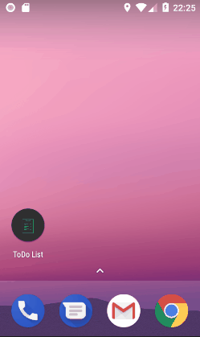

# Kotlin-TodoList-Project
Simples todo list desenvolvida em kotlin.

## Recursos utilizados
* Kotlin
* SQLite

## Executando o projeto

Com o android studio instalado, basta clonar o projeto, abrir o android studio, seleciona `opem an existing Android studio project`, ir no caminho em que o projeto foi baixado e selecioná lo, logo no android studio, basta clicar no botão run, selecionar o dispositivo em que o app ira ser executado, logo se tudo ocorrer bem a aplicação será executada.

  

## Meta
Emanuel Silva – emanuelborgesdasilva@gmail.com

Distribuído sob MIT License. Veja [LICENSE.md](LICENSE) para mais informações.
